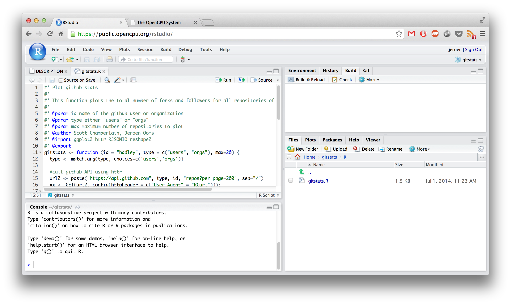
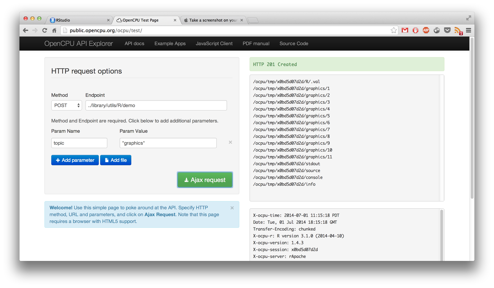

<!-- 
library(slidify)
library(slidifyLibraries)
-->

## What is OpenCPU

<q>The OpenCPU system exposes an HTTP API for scientific computing to build scalable analysis and visualization modules for use in systems, pipelines, and web applications.</q>

---

## Hello World! Basic JSON RPC 

```{bash}
curl https://public.opencpu.org/ocpu/library/stats/R/rnorm/json \
-H "Content-Type: application/json" -d '{"n":3, "mean": 10, "sd":10}'

[4.9829, 6.3104, 11.411]
```

This maps to the following request

```{r eval=FALSE, tidy=FALSE}
#library(jsonlite)
args <- fromJSON('{"n":3, "mean": 10, "sd":10}')
output <- do.call(stats::rnorm, args)
toJSON(output)
```

Which is equivalent to this function call

```{r eval=FALSE}
rnorm(n=3, mean=10, sd=10)
```

---


## What OpenCPU does:
 - Interoperable `HTTP` for data analysis
 - `RPC` and object management
 - I/O: `JSON`, `Protocol Buffers`, `CSV` 
 - Support for `parallel`/async requests
 - Highly configurable `security` policies 
 - Native `reproducibility`
 - Client libraries: `JavaScript`, `Ruby`, ...

## OpenCPU does not
 - No predefined widgets
 - No special programming paradigms
 - No need to manage processes, users, code evaluation, etc. Yet state and privacy!

---

## Beyond widgets...

[](https://www.opencpu.org/apps.html)

---

<!-- caching, HTTP :-) -->

## Keys and objects

```no-highlight
curl -v https://demo.ocpu.io/stocks/R/smoothplot -d 'ticker="GOOG"&from="2013-01-01"'

> POST /stocks/R/smoothplot HTTP/1.1
> User-Agent: curl/7.30.0
> Content-Type: application/x-www-form-urlencoded

< HTTP/1.1 201 Created
< Location: https://tmp.ocpu.io/x081cca8c23/
< Cache-Control: max-age=300, public
< Access-Control-Allow-Origin: *
< X-ocpu-session: x081cca8c23
< X-ocpu-r: R version 3.1.0 (2014-04-10)
< X-ocpu-locale: en_US.UTF-8
< X-ocpu-time: 2014-06-26 17:29:32 PDT
< X-ocpu-version: 1.4.3
< x-ocpu-cache: MISS
```

---

## State in OpenCPU


 - Each requests stateless (HTTP)
 - No single, permanent R process
 
### Instead: "functional state"

 - Each RPC stores object and returns key. No side-effects.
 - Use key to retrieve or re-use stored object
 
### Privacy?

- No users! Each key is secret
- Keys initially only known to creator
- But: you are free to share/publish keys
- Basis of "social" analysis

---


## OpenCPU apps: JavaScript Client

- App is simply a package with web pages
- Web pages call R functions via Ajax

```{javascript}
//JavaScript client code
var ticker = $("#ticker").val();    
var req = $("#plotdiv").rplot("smoothplot", {
    ticker : ticker,
    from : "2013-01-01"
})
```

Results in:

```{r, eval=FALSE}
smoothplot(ticker=ticker, from="2013-01-01")
```

Which is the basis of the [stocks](https://demo.ocpu.io/stocks/www/) app and [this jsfiddle](http://jsfiddle.net/opencpu/MkAVF/).

---

## OpenCPU and RStudio Server

[](https://public.opencpu.org/rstudio/)

---

## API testing page

[](https://public.opencpu.org/ocpu/test/)

---

## Motivation: Compare to language bridges

Bridges to R are available for most popular languages and environments:

- RInside (C++)
- rpy2 (python)
- JRI (Java)
- RinRuby
- rApache 
- littler 
- RServe (socket)
- RDCOM (windows, excel)

So why would you want to use OpenCPU?

---

## Motivation: Difficulties with language bridges

An hello-world example from the `rserve` manual:

```{java}
RConnection c = new RConnection();
double d[] = c.eval("rnorm(10)").asDoubles();
```

- Client needs to generate R syntax
- Client needs to read/manipulate internal R data types
- Client needs to manage R processes
- Limited exception handling
- No concurrency
- Result: high coupling
- Need cross-language expert to get this to work
- Fragmentation of efforts by language/environment

---

## Towards an API

OpenCPU layers on a standardized application protocol (HTTP) to provide an API for statistical computing and visualization (with R, or something else...).

### Benefits of HTTP

- Mature, very flexible application protocol
- Interoperable (both client and server!)
- Distributed (using simple URLs)
- Native exception handling (status codes)
- Many features get built-in by design (caching, encryption, authentication, etc)
- Clients widely available
- Implemented in all browsers

---

## Separation of concerns

- API describes logic of data analysis
- Independent of client/application
- Independent of computational language
- Same API could be implemented in Julia, Python, Matlab

## Important API concepts:

 1. Objects
 2. Graphics
 3. Data
 4. Manuals
 5. Namespaces
 6. Function calls

---

## The OpenCPU API

### HTTP Methods

Current API uses GET and POST methods. Get is for retrieving objects, POST is for RPC.

<table class="table table-bordered">
  <thead>
		<tr>
			<th>Method</th>
			<th>Target</th>
			<th>Action</th>
			<th>Arguments</th>		  
			<th>Example</th>
		</tr>
	</thead>
	<tbody>
		<tr>
			<td><code>GET</code></td>
			<td>object</td>
			<td>read object</td>
			<td>control output format</td>		  
			<td><code>GET /ocpu/cran/MASS/data/cats/json</code></td>
		</tr>
		<tr>
			<td><code>POST</code></td>
			<td>object</td>
			<td>call function</td>
			<td>function arguments</td>
			<td><code>POST /ocpu/library/stats/R/rnorm</code></td>
		</tr>
		<tr>
			<td><code>GET</code></td>
			<td>file</td>
			<td>read file</td>
			<td>-</td>
			<td><code>GET /ocpu/cran/MASS/NEWS</code> <br /> <code>GET /ocpu/cran/MASS/scripts/</code></td>
		</tr>  				 
		<tr>
			<td><code>POST</code></td>
			<td>file</td>
			<td>run script</td>
			<td>control interpreter </td>
			<td><code>POST /ocpu/cran/MASS/scripts/ch01.R</code> <br /><code>POST /ocpu/cran/knitr/examples/minimal.Rmd</code></td>
		</tr>						 
	</tbody>
</table>

### Try it!

 - https://public.opencpu.org/library/ocpu/{pkg}/
 - https://demo.ocpu.io/{pkg}/

---

## The OpenCPU API

### HTTP Status Codes

<table class="table table-bordered">
  <thead>
		<tr>
			<th>HTTP Code</th>
			<th>When</th>
			<th>Returns</th>
		</tr>
	</thead>
	<tbody>
		<tr>
			<td><code>200 OK</code></td>
			<td>On successful GET request</td>
			<td>Resource content</td>
		</tr>
		<tr>
			<td><code>201 Created</code></td>
			<td>On successful POST request</td>
			<td>Output location</td>
		</tr>
		<tr>
			<td><code>302 Found</code></td>
			<td>Redirect</td>
			<td>Redirect Location</td>
		</tr>
		<tr>
			<td><code>400 Bad Request</code></td>
			<td>R raised an error.</td>
			<td>Error message in <code>text/plain</code></td>
		</tr>  
		<tr>
			<td><code>502 Bad Gateway</code></td>
			<td>Nginx (opencpu-cache) can't connect to OpenCPU server.</td>
			<td>(admin needs to look in error logs)</td>
		</tr>   
		<tr>
			<td><code>503 Bad Request</code></td>
			<td>Serious problem with the server</td>
			<td>(admin needs to look in error logs)</td>
		</tr>													
	</tbody>
</table>

---

## The OpenCPU API

### Package resources

| Path               | What                                           | Examples                  |
|--------------------|------------------------------------------------|---------------------------|
| `../{pkgname}/`       | Package Information                            | `/ocpu/cran/MASS/`          |
| `../{pkgname}/R/`    | Exported R objects                             | `/ocpu/cran/MASS/R/rlm`     |
| `../{pkgname}/data/` | Data included with this package.               | `/ocpu/cran/MASS/data/cats` |
| `../{pkgname}/man/`  | Manuals (help pages) included in this package. | `/ocpu/cran/MASS/man/rlm`   |
| `../{pkgname}/*`     | Files in package installation directory        | `/ocpu/cran/MASS/NEWS`      |
|                      |                                                | `/ocpu/cran/MASS/scripts/`  |

---

## The OpenCPU API

### Session resources

| Path               | What                                     | Example                              |
|--------------------|------------------------------------------|--------------------------------------|
| `../{key}/`          | List available output for this session.  | `/ocpu/tmp/x08384729/`                 |
| `../{key}/R/`         | R objects stored in this session.        | `/ocpu/tmp/x08384729/R/.val/json`      |
| `../{key}/graphics/` | Graphics generated in this session.      | `/ocpu/tmp/x08384729/graphics/1/png`   |
| `../{key}/source`    | Input source code for this session.      | `/ocpu/tmp/x08384729/source`           |
| `../{key}/stdout`    | Text printed to STDOUT in this session   | `/ocpu/tmp/x08384729/stdout`           |
| `../{key}/console`   | Console I/O (combines source and stdout) | `/ocpu/tmp/x08384729/console`          |
| `../{key}/zip`       | Download session as a zip archive.       | `/ocpu/tmp/x08384729/zip`              |
| `../{key}/tar`       | Download session as a gzipped tarball.   | `/ocpu/tmp/x08384729/tar`              |
| `../{key}/files/*`    | Files in the working directory           | `/ocpu/tmp/x08384729/files/mydata.csv` |


---

## The OpenCPU API

### Content-types

| Format | Content-type               | Encoder (+args)         | Example                          |
|--------|----------------------------|-------------------------|----------------------------------|
| print  | `text/plain`               | base::print             | `/ocpu/cran/MASS/R/rlm/print`    |
| json   | `application/json`         | jsonlite::toJSON        | `/ocpu/cran/MASS/data/cats/json` |
| csv    | `text/csv`                 | utils::write.csv        | `/ocpu/cran/MASS/data/cats/csv`  |
| tab    | `text/plain`               | utils::write.table      | `/ocpu/cran/MASS/data/cats/tab`  |
| rda    | `application/octet-stream` | base::save              | `/ocpu/cran/MASS/data/cats/rda`  |
| rds    | `application/octet-stream` | base::saveRDS           | `/ocpu/cran/MASS/data/cats/rds`  |
| pb     | `application/x-protobuf`   | RProtoBuf::serialize_pb | `/ocpu/cran/MASS/data/cats/pb`   |
| png    | `image/png`                | grDevices::png          | `/ocpu/tmp/{key}/graphics/1/png` |
| pdf    | `application/pdf`          | grDevices::pdf          | `/ocpu/tmp/{key}/graphics/1/pdf` |
| svg    | `image/svg+xml`            | grDevices::svg          | `/ocpu/tmp/{key}/graphics/1/svg` |

---

## The OpenCPU API

### Executing Scripts

| File extension   | Type           | Interpreter                   | Arguments            |
|------------------|----------------|-------------------------------|----------------------|
| `file.r`         | R script       | evaluate::evaluate            | -                    |
| `file.tex`       | latex          | tools::texi2pdf               | -                    |
| `file.rnw`       | knitr/sweave   | knitr::knit + tools::texi2pdf | -                    |
| `file.md`        | markdown       | knitr::pandoc                 | format (see ?pandoc) |
| `file.rmd`       | knitr/markdown | knitr::knit + knitr::pandoc   | format (see ?pandoc) |
| `file.brew`      | brew           | brew::brew                    | output (see ?brew)   |

---

## Libraries

<table class="table table-bordered">
  <thead>
  	<tr>
			<th>Path</th>
			<th>What</th>
		</tr>
	</thead>
	<tbody>
		<tr>
			<td><code>/ocpu/library/{pkgname}/</code></td>
			<td>R packages installed in one of the global libraries on the server.</td>
		</tr>
		<tr>
			<td><code>/ocpu/user/{username}/library/{pkgname}/</code></td>
			<td>R packages installed in the home library of Linux user <code>{username}</code>.</td>
		</tr>
  	<tr>
			<td><code>/ocpu/cran/{pkgname}/</code></td>
			<td>Interfaces to the R package <code>{pkgname}</code> that is <i>current</i> on CRAN.</td>
		</tr>   
		<tr>
			<td><code>/ocpu/bioc/{pkgname}/</code></td>
			<td>Interfaces to the R package <code>{pkgname}</code> that is <i>current</i> on BioConductor.</td>
		</tr>  
		<tr>
			<td><code>/ocpu/github/{gituser}/{pkgname}/</code></td>
			<td>R package <code>{pkgname}</code> in the <i>master branch</i> of the identically named repository from github user <code>{gituser}</code>.</td>
		</tr>   
		<tr>
			<td><code>/ocpu/tmp/{key}/</code></td>
			<td>Temporary sessions, which hold outputs from a function/script RPC.</td>
		</tr>
	</tbody>
</table>

---

## Trying OpenCPU

### Free public demo server:

- https://public.opencpu.org/ocpu/

### Single-user development server:

```
install.packages("opencpu")
library(opencpu)
```

### Ubuntu Linux cloud server

```{no-highlight}
#requires Ubuntu 14.04
sudo add-apt-repository ppa:opencpu/opencpu-1.4
sudo apt-get update
sudo apt-get install opencpu
```

---

## Publish your packages/apps on ocpu.io

- Github Webhook: https://public.opencpu.org/ocpu/webhook
- Your package: https://yourname.ocpu.io/pkgname/

<hr>


---

## Learn more!


### API documentation

- https://www.opencpu.org/api.html

### Example Apps

- https://www.opencpu.org/apps.html
- https://github.com/opencpu

### Papers

- https://www.opencpu.org/research.html
- http://arxiv.org/a/ooms_j_1
